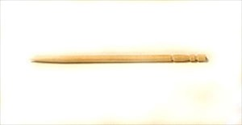
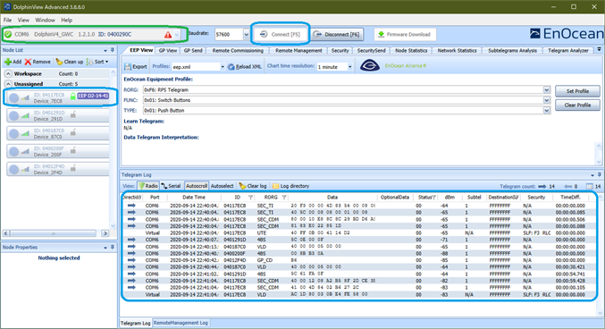
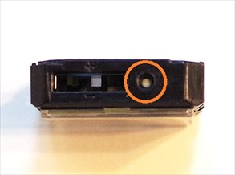
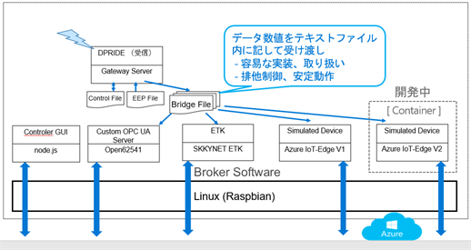

# EnOceanSeminar2020-2

EnOcean Seminar textbook in 2020 volume 2

[EnOcean IoTシステム開発コンテスト！meet up](https://algyan.connpass.com/event/183265/) 用実習セミナーのテキストです。

URL: https://algyan.connpass.com/event/183265/


##### 写真：EnOceanマルチセンサー STM550J
<br/>

---
## はじめに
---
本セミナーは、EnOcean Alliance 主催 Multi Sensor コンテスト参加者の作品制作をサポートする目的で、開催するものです。今回のセミナーで紹介するゲートウェイ・ソフトウェアの利用は応募に必須ではありません。セキュリティー機能付マルチセンサーのデータを読み出す手段として紹介しています。応募作品制作のための手段は様々です。ハードウェア、ソフトウェア等は自由に組合わせて開発して下さい。

マルチセンサーの現在の状態を整理すると次の通りになります。

- マルチセンサーは（工場出荷時、リセット時）デフォルトで「セキュリティ－機能」が有効になっています。
- 「セキュリティ－機能」が有効になっている状態の電波を読み出すには、公開キー解釈とAES復号機能を備えたプログラムが必要で、それを実現するためには復号化のための複雑なソフトウェアを用意する必要があります。

    参考：EnOcean のセキュリティー仕様は以下で公開されています。

    https://www.enocean-alliance.org/specifications/

- NFCでマルチセンサーの **「セキュリティ－機能」を無効** に設定することで、より簡単に受信アプリケーションを開発することが可能です。その場合、7月25日の「勝手にハンズオン（前半部）」で紹介したプログラムを参考にすることが可能です。

    https://github.com/ahidaka/EnOceanSeminar2020

<br/>

### コンテスト応募作品への期待

- マルチセンサーは基本的にそのままの機能で使用することを想定しています。
- 他のセンサーを補助的に追加して使用することは構いませんが、マルチセンサーは改造や加工などをせずにご利用ください。
- EnOcean技術の特長であるエネルギーハーベスティング、センサー側の工夫やアイデアについては別途、来年度のコンテストで企画する予定ですので、ご期待ください。

### 想定する作品例

- AWS, Azure, Google, IBM等の各種クラウドへの接続とサービス連係（単なる連携だけでは無く、ソリューションやアプリケーションに期待します）
- BACnet, LONWORKS, OPC UA, OCF(Alljoyn) 等の汎用プロトコル機器との接続、アプリケーション連携
- 防犯セキュリティー、見守り、運用監視、AI連携による予兆保全などのローカルアプリケーション
- Smart Speaker, Apple HomeKit, twitter, slack, 各種botサービスなどとの連携・活用
- 単なるマイコンボードでは無く、工作機械、自動車、バイク、自転車、 Drone等の機械・機器へ搭載した応用事例

### 本セミナーの内容

マルチセンサーの取り扱いと、マルチセンサーデータを読み取るオープンソースのゲートウェイ・ソフトウェアの使い方、改造のためのヒントを実習形式で学んで頂きます。

- 開発環境の動作確認

- マルチセンサーの動作確認

- ゲートウェイソフトウェアの機能学習

- ゲートウェイソフトウェアのビルドとカスタマイズ

- ブローカープログラムの開発

<br/>

### 過去のAlgyan EnOcean 関連セミナーと参考情報
<br/>

#### ALGYAN５周年IoT祭2020『リモート×計測・制御・AI』講演＆ノベルティ抽選会<br/>
「EnOceanエネルギーハーベスティング無線スイッチとセンサー」<br/>
- Connpass ページ<br/>
https://algyan.connpass.com/event/164610/

- 資料：「EnOceanエネルギーハーベスティング無線スイッチとセンサー」<br/>
https://www.slideshare.net/NETMF/join-enocean-development-contest

- Youtube ビデオ<br/>
https://youtu.be/i4tFQRzhU_Q

<br/>

#### 2020年6月10日 EnOceanセミナー#1：バッテリーレス無線センサー技術でわくわくドキドキ！<br/> 

- Connpass ページ<br/>
https://algyan.connpass.com/event/177562/

- Youtube ビデオ<br/>
https://www.youtube.com/watch?v=cJjM2A8IfVg&feature=emb_logo

- 資料：EnOcean 技術紹介 6月10日<br/>
https://www.slideshare.net/NETMF/exciting-and-thrilling-enocean-online-seminar-introduction

- 資料：EnOcean テクニカルセミナー<br/>
https://www.slideshare.net/NETMF/exciting-and-thrilling-enocean-technology-online-seminar

<br/>

#### 2020年7月15日 EnOceanテクニカルセミナー#2【応用編】勝手にハンズオン！

- Connpass ページ<br/>
https://algyan.connpass.com/event/180985/

- Youtubeビデオ<br/>
https://www.youtube.com/watch?time_continue=6&v=lw9DayRRtDU&feature=emb_logo

- 資料：Multi Sensorとコンテスト紹介・最終版<br/>
https://www.slideshare.net/NETMF/exciting-and-thrilling-enocean-online-seminar-introduction-final-edition

- 資料：EnOcean テクニカルセミナー #2 勝手にハンズオン<br/>
https://www.slideshare.net/NETMF/exciting-and-thrilling-enocean-technology-online-seminar-2

- 勝手に実習テキスト(GitHub, download用)<br/>
https://github.com/ahidaka/EnOceanSeminar2020

- 勝手に実習テキスト(GitHub Page, 参照用)<br/>
https://ahidaka.github.io/EnOceanSeminar2020/

<br/>

### 掲示板 Q&A<br/>
- [EnOceanセミナー#1：バッテリーレス無線センサー技術でわくわくドキドキ！Q&A](http://enocean.jp/node/78)<br/>
http://enocean.jp/node/78

- [EnOceanセミナー#2：バッテリーレス無線センサー技術でわくわくドキドキ！Q&A](http://enocean.jp/node/79)<br/>
http://enocean.jp/node/79

<br/>

---
## 開発環境とマルチセンサーの動作確認
---

### 開発環境の確認
- Windows PC + USB400J<br/>
- 実習用ホストマシン (+ USB400J)<br/>
- EnOcean Multi Sensor (操作ピン + オプション)<br/>
<br/>

#### Windows PC + USB400J
- USB Type A コネクタが使える Windows PC（MacやWindowsのVM上での動作は自己責任）
- テキストの参照とDolphinView Advancedの実行環境に使用します
- 事前にWindows PCにUSB400Jを接続して、DolphinView Advancedの起動を確認しておいてください。

    DolphinView Advancedは以下のURLからダウンロードしてインストールします。ダウンロードにはメールアドレスの登録が必要です。
https://www.enocean.com/en/support/download/


##### 写真：Windows PC + USB400J

<br/>

#### 実習用ホストマシン + USB400J
　- USB Type A コネクタが使える RaspbianまたはUbuntu 16.04以降搭載のLinuxマシン

事前にOSの起動を確認して、次のインストールを行っておいてください。
```sh
$ sudo apt update
$ sudo apt install -y git build-essential net-tools libxml2-dev
```
 

##### 写真：Raspberry Pi 3 とUbuntu 18.04動作のPC 例

<br/>

#### EnOcean Multi Sensor
 - ボタン電池を使用しない方は、スリーブモードのまま事前に太陽光または白熱電球で3時間以上蓄電しておいてください。（必須）
 - 爪楊枝、または伸ばしたクリップ等、Multi Sensorのボタンを押すピン（必須）
 - ボタン電池 CR1632（オプション）
 - NFCが利用できるスマホまたはiPhone（オプション）
以下のURLで紹介のEnOcean Toolをインストールして使用します。
https://www.enocean.com/en/products/enocean-software/enocean-tool/


##### 写真：EnOceanマルチセンサー STM550J
<br/>


##### 写真：爪楊枝
<br/>


##### 写真：クリップ
<br/>

---
## マルチセンサーの動作確認
---
Windows PC でDolphinView Advanceを動作させて、マルチセンサーの動作を確認します。<br/>

### 使用するもの
- Windows PC
- USB400J
- マルチセンサー
- 爪楊枝またはクリップ等、マルチセンサーのボタンを押す尖ったピン類

<br/>

### 概要説明

次の手順でWindows PC にインストールしたDolphinView Advancedを使用して、マルチセンサーの動作確認を行います。
- DolphinView Advancedのインストール
- DolphinView Advancedの起動と操作
- マルチセンサーの操作
- テレグラムの確認

<br/>

### DolphinView Advanced のインストール

Windows PCで操作すて、DolphinView Advancedは以下のURLからダウンロードしてインストールします。ダウンロード時にはメールアドレスの登録が必要です。
https://www.enocean.com/en/support/download/

ダウンロード完了後 **USB400Jを装着して** 、DolphinViewAdvanced_3880.exeを起動してDolphinView Advanced をインストールします。すでに DolphinView Advanced インストールしている場合は、上書きインストールされます。

<br/>

### DolphinView Advanced の起動と操作

インストール完了後、自動的に DolphinView Advanced が起動するので、次の操作をします。<br/>
(起動しない場合は起動して下さい。)

[](image/dpvp.png)

- 上部左側の右側に接続COMポート番号が表示されていることを確認します。

- 上部中央の **Connect** ボタンをクリックします。

- 下部中央には、受信したテレグラムの内容が表示されます。

<br/>

### マルチセンサーの操作

マルチセンサーの次の操作を行って、DolphinView Advanced のテレグラム表示を確認します。

- LEARNボタン

- 磁石（開閉センサー）

- 加速度センサー

<br/>

#### LEARN ボタン
DolphinViewを動作させたまま、マルチセンサーのLEARNボタンを尖ったピンで突いて、Teach-In テレグラムの送出を確認します。



<br/>

#### 磁石（開閉センサー）

★

<br/>

#### 加速度センサー

★

<br/>

### テレグラムの確認

★

<br/>

---
## ゲートウェイソフトウェアの機能学習
---

今回のセミナーで利用するゲートウェイソフトウェアは、株式会社デバイスドライバーズが販売している、**E-Kit EnOcean ゲートウェイ** に搭載のプログラムです。　基本的にはオープンソースのプログラムですが、EnOcean Alliance が持つ **IP** 規定により、非会員の業務での利用が制限される部分に関してはバイナリーライブラリとして公開しています。

### ゲートウェイソフトウェア概要

今回のセミナーで利用するゲートウェイソフトウェアは、株式会社デバイスドライバーズが販売している、**E-Kit EnOcean ゲートウェイ** に搭載のプログラムです。　基本的にはオープンソースのプログラムですが、EnOcean Alliance が持つ **IP** 規定により、非会員の業務での利用が制限される部分に関してはバイナリーライブラリとして公開しています。

ゲートウェイのGUI部分のソースコードは、「ゲートウェイ開発キット」として販売しています。
全ソースコードは、会員企業向けに販売しています。

<br/>

### 応用製品紹介

- 製品販売ページ

    [E-Kit EnOceanゲートウェイ](http://e-kit.jp/products/EnOcean/EO-DCGW){:target="_blank"}<br/>
    http://e-kit.jp/products/EnOcean/EO-DCGW

    [E-Kitゲートウェイ開発キット](http://e-kit.jp/products/EnOcean/EO-EKITGW-DEV){:target="_blank"}<br/>
    http://e-kit.jp/products/EnOcean/EO-EKITGW-DEV

- 取り扱い説明書

    https://devdrv.github.io/E-Kit-Gateway-Manual/

<br/>

### 起動オプション
dpride (Dolphin Ride プログラム、以後 dpride) は、Linux シェルから起動する GUI を持たないプログラムです。起動時に無効なオプションを指定すると下記の Usage を表示して終了します。各オプションには、最適なデフォルトを用意しているため、実際の利用時には、最低限のオプション設定で動作します。

- ddpride Usage 表示
```sh
Usage: dpride [-m|-r|-o][-c][-v]
  [-d Directory][-f Controlfile][-e EEPfile][-b BrokerFile]
  [-s SeriaPort][-z CommandFile][-t timeout seconds]

  Operation mode:
    -m    Monitor mode
    -r    Register mode
    -o    Operation mode
    -c    Clear settings before register
  Output log options:
    -l    Output websocket log for logger client
    -L    Output local logfile log
    -j    Provide JSON service (Experimental)
    -J    JSON TCP socket service port (default:8000)
  Runtime options:    -d directory   Bridge file directrory
    -f file        Control file
    -e eepfile     EEP file
    -b brokerfile  Broker file
    -s device      ESP3 serial port device name
    -z commfile    Command file
    -g modelfile   Generic Model file
    -k publickeyfile Public key file
    -t secs        Timeout seconds for register
  Options for development:
    -A    Print All (EEP) profile
    -v    View working status (verbose message level)
    -D    Add debug level
    -p    Display packet debug
    -P    Don't display packet debug (default)
    -q    Quiet mode, don't display message without debug
```

<br/>

### 全体構造

<br/>

図ざああああ

[](image/DPRIDE.png)

<br/>

### 参考：インターフェース誌の解説
本プログラム開発の経緯と初期バージョンの解説は、下記のインターフェース誌に掲載されています。

]
##### 写真：インターフェース 2017年11月号
<br/>

---
## ゲートウェイソフトウェアのビルドとカスタマイズ
---
それでは ゲートウェイソフトウェア **dpride** をビルドして使ってみます。

<br/>

### 環境に合わせたライブラリの用意

**dpride** は EnOcean Alliance の **IP（知的財産）** 利用ポリシーのため、全ソースコードは一般公開していません。
一部の機能はバイナリーのライブラリで公開しているので、それを利用します。従って使用する **ABI(Application Binary Interface** に合致したライブラリを事前にインストールする必要があります。ライブラリのインストール手順は次の通りです。

★要検証★

```sh
$ cd eolib
$ make `arch`
```

注意：**arch** は現在実行中のマシンアーキテクチャを表示するコマンドで、上記はこれを **Back Quote (`)**　で呼び出しています。現在のライブラリが用意しているアーキテクチャは、x86_64, amnv7l, aarch64 だけです。

<br/>

### ビルドと動作確認

用意したターゲットホスト環境にゲートウェイソフトウェアのソースコードをインストールして動作確認します。

もしUSB400Jを2個持っている方は、同時に Windows PC のDolphinView Advanced の動作と比べる事ができます。

#### ビルド
次の様に、dprideのディレクトリへ行って、**make** コマンド実行でビルドが完了し、**.\dpride** が作成されます。

```sh
$ cd ../dpride
$ make
```

#### マルチセンサーの登録
dprideの動作モードは次の三種類があり、起動時のパラメータで設定します。

#### dprideの動作モード
- **-r** ：登録モード<br/>
Teach-In テレグラムを受信して内部テーブルにデバイスを登録します。<br/>
Teach-In で公開キーが送られて来る場合は解釈して登録します。
<br/>

- **-o** ：運用モード<br/>
内部テーブルに登録済のデバイスからテレグラムだけを受信して解釈します。<br/>
Teach-In テレグラムは無視します。
<br/>

- **-m**：モニターモード<br/>
全てのテレグラムを受信して解釈しようとします。<br/>
主に実験、動作確認様です。

```sh
$ cd dpride
$ make
```


#### マルチセンサーのデータ表示

<br/>

### オプション機能紹介

<br/>

---
## ブローカープログラムの開発
---

### ゲートウェイシステムの構成


