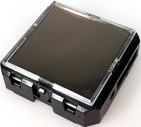

# EnOceanSeminar2020-2

EnOcean Seminar textbook in 2020 volume 2

[EnOcean IoTシステム開発コンテスト！meet up](https://algyan.connpass.com/event/183265/) 用実習セミナーのテキストです。

URL: https://algyan.connpass.com/event/183265/


##### 写真：EnOceanマルチセンサー STM550J

---
## 内容
---
- 開発環境とマルチセンサーの動作確認

- ゲートウェイソフトウェアの機能学習

- ゲートウェイソフトウェアのビルドとカスタマイズ

- ブローカープログラムの開発

### 参考情報

#### 過去のAlgyan EnOcean セミナーリンク

ALGYAN５周年IoT祭2020『リモート×計測・制御・AI』講演＆ノベルティ抽選会<br/>
「EnOceanエネルギーハーベスティング無線スイッチとセンサー」<br/>
https://www.slideshare.net/NETMF/join-enocean-development-contest

Youtubeビデオ<br/>
https://youtu.be/i4tFQRzhU_Q


2020年6月10日 EnOceanセミナー#1：バッテリーレス無線センサー技術でわくわくドキドキ！ 
https://algyan.connpass.com/event/177562/

Youtubeビデオ<br/>
https://www.youtube.com/watch?v=cJjM2A8IfVg&feature=emb_logo

https://www.slideshare.net/NETMF/exciting-and-thrilling-enocean-online-seminar-introduction

https://www.slideshare.net/NETMF/exciting-and-thrilling-enocean-technology-online-seminar


<br/>

#### 2020年7月15日 EnOceanテクニカルセミナー#2【応用編】勝手にハンズオン！

- Connpass募集ページ<br/>
https://algyan.connpass.com/event/180985/

- Youtubeビデオ<br/>
https://www.youtube.com/watch?time_continue=6&v=lw9DayRRtDU&feature=emb_logo

https://www.slideshare.net/NETMF/exciting-and-thrilling-enocean-online-seminar-introduction-final-edition

https://www.slideshare.net/NETMF/exciting-and-thrilling-enocean-technology-online-seminar-2

- 勝手に実習テキスト(GitHub, download用)<br/>
https://github.com/ahidaka/EnOceanSeminar2020

- 勝手に実習テキスト(GitHub Page, 参照用)<br/>
https://ahidaka.github.io/EnOceanSeminar2020/

#### 掲示板 Q&A

- [EnOceanセミナー#1：バッテリーレス無線センサー技術でわくわくドキドキ！Q&A](http://enocean.jp/node/78)

- [EnOceanセミナー#2：バッテリーレス無線センサー技術でわくわくドキドキ！Q&A](http://enocean.jp/node/79)


---
## 開発環境とマルチセンサーの動作確認
---

### 開発環境の確認
- Windows PC + USB400J<br/>
- 実習用ホストマシン (+ USB400J)<br/>
- EnOcean Multi Sensor (操作ピン + オプション)<br/>
<br/>

#### Windows PC + USB400J
- USB Type A コネクタが使える Windows PC（MacやWindowsのVM上での動作は自己責任）
- テキストの参照とDolphinView Advancedの実行環境に使用します
- 事前にWindows PCにUSB400Jを接続して、DolphinView Advancedの起動を確認しておいてください。

    DolphinView Advancedは以下のURLからダウンロードしてインストールします。ダウンロードにはメールアドレスの登録が必要です。
https://www.enocean.com/en/support/download/


##### 写真：Windows PC + USB400J
<br/>

#### 実習用ホストマシン + USB400J
　- USB Type A コネクタが使える RaspbianまたはUbuntu 16.04以降搭載のLinuxマシン

事前にOSの起動を確認して、次のインストールを行っておいてください。
```sh
$ sudo apt update
$ sudo apt install -y git build-essential net-tools libxml2-dev
```
 

##### 写真：Raspberry Pi 3 とUbuntu 18.04動作のPC 例
<br/>

#### EnOcean Multi Sensor
 - ボタン電池を使用しない方は、スリーブモードのまま事前に太陽光または白熱電球で3時間以上蓄電しておいてください。（必須）
 - 爪楊枝、または伸ばしたクリップ等、Multi Sensorのボタンを押すピン（必須）
 - ボタン電池 CR1632（オプション）
 - NFCが利用できるスマホまたはiPhone（オプション）
以下のURLで紹介のEnOcean Toolをインストールして使用します。
https://www.enocean.com/en/products/enocean-software/enocean-tool/


##### 写真：STM550J
<br/>

---
### マルチセンサーの動作確認

Windows PC でDolphinView Advanceを動作させて、マルチセンサーの動作を確認します。

---
## ゲートウェイソフトウェアの機能学習
---

### ゲートウェイソフトウェア概要

#### 応用製品紹介

- 製品販売ページ

- 取り扱い説明書

#### 単体動作時オプション

#### 全体構造

図

インターフェース誌


---
## ゲートウェイソフトウェアのビルドとカスタマイズ
---
### ビルドと動作確認

### オプション機能紹介


---
## ブローカープログラムの開発
---

### ゲートウェイシステムの構成


