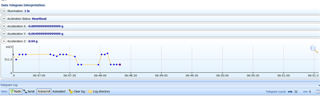

# EnOceanSeminar2020-2

EnOcean Seminar textbook in 2020 volume 2

- GitHub Page<br/>
    https://ahidaka.github.io/EnOceanSeminar2020-2

<br/>

[EnOcean IoTシステム開発コンテスト！meet up](https://algyan.connpass.com/event/183265/) 用実習セミナーのテキストです。

- URL<br/>
    https://algyan.connpass.com/event/183265/

<br/>


##### 写真：EnOceanマルチセンサー STM550J
<br/>

---
## はじめに
---
本セミナーは、EnOcean Alliance 主催 Multi Sensor コンテスト参加者の作品制作をサポートする目的で、開催するものです。今回のセミナーで紹介するゲートウェイ・ソフトウェアの利用は応募に必須ではありません。セキュリティー機能付マルチセンサーのデータを読み出す手段として紹介しています。応募作品制作のための手段は様々です。ハードウェア、ソフトウェア等は自由に組合わせて開発して下さい。

マルチセンサーの現在の状態を整理すると次の通りになります。

- マルチセンサーは（工場出荷時、リセット時）デフォルトで「セキュリティ－機能」が有効になっています。
- 「セキュリティ－機能」が有効になっている状態の電波を読み出すには、公開キー解釈とAES復号機能を備えたプログラムが必要で、それを実現するためには復号化のための複雑なソフトウェアを用意する必要があります。

    参考：EnOcean のセキュリティー仕様は以下で公開されています。

    https://www.enocean-alliance.org/specifications/

- NFCでマルチセンサーの **「セキュリティ－機能」を無効** に設定することで、より簡単に受信アプリケーションを開発することが可能です。<br/>
その場合は今回のセミナーで紹介するゲートウェイプログラムを使用せずに、7月25日の「勝手にハンズオン（前半部）」で紹介したWindows用プログラムと、Linux 環境動作確認プログラム用プログラム参考にすることが可能です。<br/>
    * 勝手にハンズオン プログラム（Windows C#）<br/>
    https://github.com/ahidaka/EnOceanSeminar2020
    * Linux 環境動作確認プログラム（Linux C）<br/>
    https://github.com/ahidaka/EnOceanLinuxTest

<br/>

### コンテスト応募作品への期待

- マルチセンサーは基本的にそのままの機能で使用することを想定しています。
- 他のセンサーを補助的に追加して使用することは構いませんが、マルチセンサーは改造や加工などをせずにご利用ください。
- EnOcean技術の特長であるエネルギーハーベスティング、センサー側の工夫やアイデアについては別途、来年度のコンテストで企画する予定ですので、ご期待ください。

### 想定する作品例

- AWS, Azure, Google, IBM等の各種クラウドへの接続とサービス連係（単なる連携だけでは無く、ソリューションやアプリケーションに期待します）
- BACnet, LONWORKS, OPC UA, OCF(Alljoyn) 等の汎用プロトコル機器との接続、アプリケーション連携
- 防犯セキュリティー、見守り、運用監視、AI連携による予兆保全などのローカルアプリケーション
- Smart Speaker, Apple HomeKit, twitter, slack, 各種botサービスなどとの連携・活用
- 単なるマイコンボードでは無く、工作機械、自動車、バイク、自転車、 Drone等の機械・機器へ搭載した応用事例

### 本セミナーの内容

マルチセンサーの取り扱いと、マルチセンサーデータを読み取るオープンソースのゲートウェイ・ソフトウェアの使い方、改造のためのヒントを実習形式で学んで頂きます。

- 開発環境の動作確認

- マルチセンサーの動作確認

- ゲートウェイソフトウェアの機能

- ゲートウェイソフトウェアのビルドとカスタマイズ

- ブローカープログラムの開発

- NFCによるセンサーの設定書き換えとQ&A

<br/>

### 過去のAlgyan EnOcean 関連セミナーと参考情報
<br/>

#### ALGYAN５周年IoT祭2020『リモート×計測・制御・AI』講演＆ノベルティ抽選会<br/>
「EnOceanエネルギーハーベスティング無線スイッチとセンサー」<br/>
- Connpass ページ<br/>
https://algyan.connpass.com/event/164610/

- 資料：「EnOceanエネルギーハーベスティング無線スイッチとセンサー」<br/>
https://www.slideshare.net/NETMF/join-enocean-development-contest

- Youtube ビデオ<br/>
https://youtu.be/i4tFQRzhU_Q

<br/>

#### 2020年6月10日 EnOceanセミナー#1：バッテリーレス無線センサー技術でわくわくドキドキ！<br/> 

- Connpass ページ<br/>
https://algyan.connpass.com/event/177562/

- Youtube ビデオ<br/>
https://www.youtube.com/watch?v=cJjM2A8IfVg&feature=emb_logo

- 資料：EnOcean 技術紹介 6月10日<br/>
https://www.slideshare.net/NETMF/exciting-and-thrilling-enocean-online-seminar-introduction

- 資料：EnOcean テクニカルセミナー<br/>
https://www.slideshare.net/NETMF/exciting-and-thrilling-enocean-technology-online-seminar

<br/>

#### 2020年7月15日 EnOceanテクニカルセミナー#2【応用編】勝手にハンズオン！

- Connpass ページ<br/>
https://algyan.connpass.com/event/180985/

- Youtubeビデオ<br/>
https://www.youtube.com/watch?time_continue=6&v=lw9DayRRtDU&feature=emb_logo

- 資料：Multi Sensorとコンテスト紹介・最終版<br/>
https://www.slideshare.net/NETMF/exciting-and-thrilling-enocean-online-seminar-introduction-final-edition

- 資料：EnOcean テクニカルセミナー #2 勝手にハンズオン<br/>
https://www.slideshare.net/NETMF/exciting-and-thrilling-enocean-technology-online-seminar-2

- 勝手に実習テキスト(GitHub, download用)<br/>
https://github.com/ahidaka/EnOceanSeminar2020

- 勝手に実習テキスト(GitHub Page, 参照用)<br/>
https://ahidaka.github.io/EnOceanSeminar2020/

<br/>

### 掲示板 Q&A<br/>
- [EnOceanセミナー#1：バッテリーレス無線センサー技術でわくわくドキドキ！Q&A](http://enocean.jp/node/78)<br/>
http://enocean.jp/node/78

- [EnOceanセミナー#2：バッテリーレス無線センサー技術でわくわくドキドキ！Q&A](http://enocean.jp/node/79)<br/>
http://enocean.jp/node/79

<br/>

---
## 開発環境とマルチセンサーの動作確認
---

### 開発環境の確認
- Windows PC + USB400J<br/>
- 実習用ホストマシン (+ USB400J)<br/>
- EnOcean Multi Sensor (操作ピン + 磁石)<br/>
- NFCが利用できるスマートフォンまたはNFCライター (オプション)<br/>
<br/>

#### Windows PC + USB400J
- USB Type A コネクタが使える Windows PC（MacやWindowsのVM上での動作は自己責任）
- テキストの参照とDolphinView Advancedの実行環境に使用します
- 事前にWindows PCにUSB400Jを接続して、DolphinView Advancedの起動を確認しておいてください。

    DolphinView Advancedは以下のURLからダウンロードしてインストールします。ダウンロードにはメールアドレスの登録が必要です。
https://www.enocean.com/en/support/download/


##### 写真：Windows PC + USB400J

<br/>

#### 実習用ホストマシン + USB400J
　- USB Type A コネクタが使える RaspbianまたはUbuntu 16.04以降搭載のLinuxマシン

事前にOSの起動を確認して、次のインストールを行っておいてください。
```sh
$ sudo apt update
$ sudo apt install -y git build-essential net-tools libxml2-dev
```
 

##### 写真：Raspberry Pi 3 とUbuntu 18.04動作のPC 例

<br/>

#### EnOcean マルチセンサー
 - ボタン電池を使用しない方は、スリーブモードのまま事前に太陽光または白熱電球で3時間以上蓄電しておいてください。（必須）
 - 爪楊枝、または伸ばしたクリップ等、マルチセンサーのボタンを押すピン（必須）
 - 開閉センサー用ネオジム永久磁石（セミナー受講者には送付済）
 - ボタン電池 CR1632（オプション）
 - NFCが利用できるスマホまたはiPhone（オプション、シャープやソニー製等の一部国産のスマホは利用出来ません）<br/>
    以下のURLで紹介のEnOcean Toolをインストールして使用します。<br/>
    https://www.enocean.com/en/products/enocean-software/enocean-tool/

 - 参考：EnOcean NFC Configurator（NFCカードライターとツール）<br/>
  https://www.enocean.com/en/support/download/
  <br/>


##### 写真：EnOceanマルチセンサー STM550J
<br/>


##### 写真：爪楊枝
<br/>


##### 写真：クリップ
<br/>

---
## マルチセンサーの動作確認
---
Windows PC でDolphinView Advanceを動作させて、マルチセンサーの動作を確認します。<br/>

### 使用するもの
- Windows PC
- USB400J
- マルチセンサー
- 爪楊枝またはクリップ等、マルチセンサーのボタンを押す尖ったピン類

<br/>

### 概要説明

次の手順でWindows PC にインストールしたDolphinView Advancedを使用して、マルチセンサーの動作確認を行います。
- DolphinView Advancedのインストール
- DolphinView Advancedの起動と操作
- マルチセンサーの操作
- テレグラムの確認

<br/>

### DolphinView Advanced のインストール

Windows PCで操作して、DolphinView Advancedは以下のURLからダウンロードしてインストールします。ダウンロード時にはメールアドレスの登録が必要です。
https://www.enocean.com/en/support/download/

ダウンロード完了後 **USB400Jを装着して** 、DolphinViewAdvanced_3880.exeを起動してDolphinView Advanced をインストールします。すでに DolphinView Advanced インストールしている場合は、上書きインストールされます。

<br/>

### DolphinView Advanced の起動と操作

インストール完了後、自動的に DolphinView Advanced が起動するので、次の操作をします。<br/>
(起動しない場合は起動して下さい。)

[](image/dpvp.png)
##### 画面：DolphinView
<br/>

- 上部左側の右側に接続COMポート番号が表示されていることを確認します。

- 上部中央の **Connect** ボタンをクリックします。

- 下部中央には、受信したテレグラムの内容が表示されます。

<br/>

### マルチセンサーの操作

マルチセンサーの次の操作を行って、DolphinView Advanced のテレグラム表示を確認します。

- LEARNボタン

- 磁石（開閉センサー）

- 加速度センサー

<br/>

#### LEARN ボタン
DolphinViewを動作させたまま、マルチセンサーのLEARNボタンを尖ったピンで突いて、Teach-In テレグラムの送出と、EnOceam IDとプロファイルが登録されることを確認します。


<br/>

#### 磁石（開閉センサー）
マルチセンサーが持つ **Magnet Contact** センサー部分に、添付の磁石を近づけて、動作を確認します。マルチセンサー裏面の ▶（三角）マークが磁石接触の目印です。なお使用する付属の磁石は非常に強力なため、心臓ペースメーカー利用者に近づけるないなど、取り扱いには十分注意してください。

なお一般的なフェライトの磁石では、近づけてもセンサーは反応しません。
<br/>

[](image/mark.png)

<br/>

#### 加速度センサー

標準設定プロファイルの加速度センサーは、加速度を検知するというよりは、重力検知によるセンサーの姿勢（３軸の傾き）をセンシングします。

DolphinView の中央部のタブメニューを **EEPView** も切り替えた後、**Accelarletion Z:** グラフを表示させて、太陽電池を上向きにした状態の磁石の接続と、下向きにした状態の次の様なグラフ表示の遷移を確認します。
<br/>

[](image/acc.png)

<br/>

### LEARNボタンによる設定

LEARNボタンの押し方による設定変更事例です。頻繫に使用する4秒間押しの、**スリーブ開始** (Airplane mode) だけを試します。他の機能は今回は使用しません。

- 設定可能項目

    | 押し方 | 時間間隔 | 設定内容 | LED表示 |
    |:-:|:-:|:-:|:-:|
    | Single Short | 1秒以下 | スリーブ終了, Teach-In 送信 | 成功：1点滅 |
    | Double Short | 1秒以下押,1秒以下離,1秒以下押 | 機能テスト, 2分または他ボタンで終了 | 高速点滅 |
    | Triple Short | 1秒以下押,1秒以下離 x 3回 | LED表示変更(トグル) | 成功：2点滅 |
    | Single Long | 3～5秒 | スリーブ開始 | 成功：3点滅 |
    | Double Long | 3～5秒押,1秒以下離,3～5秒押 | ハイセキュリティモード | 成功：2点滅 |
    | Very Long | 8秒以上 | 工場出荷状態リセット | 成功：5点滅 |

    #### 表：ボタン設定の一覧

<br/>

### NFCによる設定

注意：この項は参加者全員が対応のスマホ等を持っていないため、最後にデモを交えて解説します。

#### 参考の設定ビデオ

- デバイスドライバーズ E-Kitチャンネル<br/>
    https://www.youtube.com/watch?v=24BFDGHja9c

- EnOcean GmbH<br/>
    https://youtu.be/rfqTBlPfd_Q

- EEP設定

    | EEP | Telegram Type | Data |
    |:-:|:-:|:-:|
    | D2-14-41 | VLD (9 Byte) | 温度,湿度,照度,加速度,コンタクト |
    | D2-14-40 | VLD (9 Byte) | 温度,湿度,照度,加速度 |
    | A5-02-05 | 4BS | 温度 (0～40℃) |
    | A5-04-01 | 4BS | 温度 (0～40℃) , 湿度 |
    | A5-04-03 | 4BS | 温度 (-20～60℃) , 湿度 |
    | A5-06-02 | 4BS | 照度 (0～1020lx 8bit) |
    | A5-06-03 | 4BS | 照度 (0～1000lx 10bit) |
    | A5-14-05 | 4BS | バイブレーション検知 |
    | D5-00-01 | 1BS | マグネット・コンタクト|

    #### 表：マルチセンサーEEP設定の一覧表

<br/>

- 他の設定または実行項目

    * Activity threashold to trgger<br/>
    開閉センサーなどの使用しているセンサー・データ値による検知強度を設定します。<br/>
    例えばHigh設定の場合、磁石を検知ポイントに接触させても電波送信しなくなります。

    * Transmission Frequecy<br/>
    定期的なテレグラム送信の頻度を、小・中・大で設定します。<br/>
    実際の送信間隔は使用するセンサー種別とEEPによって異なります。

    * LED Indicator<br/>
    LEDのON/OFFを設定します。<br/>

    * Encription<br/>
    セキュリティー機能の有効化・無効を設定します。<br/>

    * Learn button usage for security<br/>
    セキュリティー設定時のLEARNボタンの動作を設定します。<br/>
    OFFにするとセキュリティー情報を含むTEACH-INテレグラムを送信しません。

    * Installation Note<br/>
    メモ情報を設定します。

    * Factory default (Reset)<br/>
    工場出荷状態に設定します。

    * Airplane mode<br/>
    スリーブモードに設定します。

    * Function test<br/>
    機能テストを実行します。

    * Learn Telegram<br/>
    LEARN テレグラムを送信します。

    * Measurement of the light conditions<br/>
    照度センサーで測定した照度を表示します。

    * Pin<br/>
    パスワードを設定します。

<br/>

---
## ゲートウェイソフトウェアの機能
---

今回のセミナーで利用するゲートウェイソフトウェアは、株式会社デバイスドライバーズが販売している、**E-Kit EnOcean ゲートウェイ** に搭載のプログラムです。　基本的にはオープンソースのプログラムですが、EnOcean Alliance が持つ **IP** 規定により、非会員の業務での利用が制限される部分に関してはバイナリーライブラリとして公開しています。

### ゲートウェイソフトウェア概要

今回のセミナーで利用するゲートウェイソフトウェアは、株式会社デバイスドライバーズが販売している、**E-Kit EnOcean ゲートウェイ** に搭載のプログラムです。　基本的にはオープンソースのプログラムですが、EnOcean Alliance が持つ **IP** 規定により、非会員の業務での利用が制限される部分に関してはバイナリーライブラリとして公開しています。

ゲートウェイのGUI部分のソースコードと社内再利用ライセンスは、「ゲートウェイ開発キット」として販売しています。EnOcean Alliance 会員企業が購入の場合は、一般非公開の **GP(Generic Profile)** と **EnOcean Security** 部分のソースコードも付属します。

<br/>

### 応用製品紹介

- 製品販売ページ

    [E-Kit EnOceanゲートウェイ](http://e-kit.jp/products/EnOcean/EO-DCGW)<br/>
    http://e-kit.jp/products/EnOcean/EO-DCGW

    [E-Kitゲートウェイ開発キット](http://e-kit.jp/products/EnOcean/EO-EKITGW-DEV)<br/>
    http://e-kit.jp/products/EnOcean/EO-EKITGW-DEV

- 取り扱い説明書

    [E-Kitゲートウェイ開発キット](https://devdrv.github.io/E-Kit-Gateway-Manual/)<br/>
    https://devdrv.github.io/E-Kit-Gateway-Manual/

- デモ

    * ログイン
    * 制御画面（iBRESS Cloud, Microsoft Azure, OPC UA）
    * EnOcean デバイスのモニター
    * EnOcean デバイスの登録
    * EnOcean デバイスの運用
    * 運用ログ機能
    * その他（システム管理、ファームウェア更新）

<br/>

### 起動オプションと機能
dpride (Dolphin Ride プログラム、以後 dpride) は、Linux シェルから起動する GUI を持たないコマンドインターフェースのプログラムで、前述のゲートウェイの基本部分となっています。ゲートウェイ製品では Web UI を提供する別プログラムや、各種サービス用ブローカープログラム、ログ管理、WatchDog、ファームウェア更新機能を搭載しています。しかしdpride は元々、単体で使用することを想定して開発していたため、今回のセミナーで扱う様に、単体でも利用可能です。

dpride 起動時に **-help** または **-\\?** などの無効なオプションを指定すると下記の Usage を表示して終了します。各オプションには、最適なデフォルトを用意しているため、実際の利用時には、最低限のオプション設定で動作します。

- dpride Usage 表示
```sh
Usage: dpride [-m|-r|-o][-c][-v]
  [-d Directory][-f Controlfile][-e EEPfile][-b BrokerFile]
  [-s SeriaPort][-z CommandFile][-t timeout seconds]

  Operation mode:
    -m    Monitor mode
    -r    Register mode
    -o    Operation mode
    -c    Clear settings before register
  Output log options:
    -l    Output websocket log for logger client
    -L    Output local logfile log
    -j    Provide JSON service (Experimental)
    -J    JSON TCP socket service port (default:8000)
  Runtime options:    -d directory   Bridge file directrory
    -f file        Control file
    -e eepfile     EEP file
    -b brokerfile  Broker file
    -s device      ESP3 serial port device name
    -z commfile    Command file
    -g modelfile   Generic Model file
    -k publickeyfile Public key file
    -t secs        Timeout seconds for register
  Options for development:
    -A    Print All (EEP) profile
    -v    View working status (verbose message level)
    -D    Add debug level
    -p    Display packet debug
    -P    Don't display packet debug (default)
    -q    Quiet mode, don't display message without debug
```

<br/>

### 全体構造

dpride と関連プログラム、データの構造の概要を簡単に説明します。

<br/>

#### 管理ディレクトリ

dprideは、EnOcean テレグラムを受信して解釈し、他のサービスへデータを受け渡すゲートウェイ機能を持ちます。EnOcean の各デバイスは EURID(EnOcean Unique Radio Identifir, 以降EnOcean ID)と、EEP(EnOcean Equipmet Profile) または、GP(Generic Profile) と呼ぶアプリケーション層のプロファイルを持つため、実際の業務で使用するためには、ゲートウェイ側でこれらを解釈、管理するための仕組みが必要です。またセキュリティテレグラムを解釈するためには、公開キーを管理する必要があります。dprideではこれらの管理データを **/var/tmp/dpride** ディレクトリ以下に保存しています。

<br/>

#### ブリッジファイル

Bridge File は、ゲートウェイが受信したデバイスの各データを各BROKER プログラムに受け渡すためのデータファイルです。

ユニークなデータポイント名を持つ各テキストファイルに、dprideが **「-999.99」** 形式の数字文字列でデータを記述し、各ブローカープログラムがその値を読み取って利用します。各ブローカープログラムは、Signalでブリッジファイルが書き換えられたことを知ることができます。

ブリッジファイルは、**/var/tmp/dpride** ディレクトリ以下に、プロファイル情報から自動的に割り当てられる **Data Point** 名のファイルです。
<br/>

#### コントロールファイル

Teach-Inで登録済の各デバイスの EnOcean ID, EEP または GP, 全データポイント名（Bridge File名）を管理する、CSV形式のファイルです。このコントロールファイルにより、各IDのデバイスがどのようなプロファイル(EEP/GP)を持ち、どのようなデータポイントを持つかを知ることができます。

コントロールファイルは、**/var/tmp/dpride/eofilter.txt** という名前のファイルです。各デバイスのID毎に、プロファイル情報とブリッジファイル名の一覧を **CSV** 形式で持ちます。

<br/>

ゲートウェイシステムの全体構造図を以下に示します。

<br/>

[](image/DPRIDE.png)

<br/>

### 参考：インターフェース誌の解説
本プログラム開発の経緯と初期バージョンの解説は、下記のインターフェース誌にも掲載されています。

]
##### 写真：インターフェース 2017年11月号
<br/>

---
## ゲートウェイソフトウェアのビルドと動作確認
---
それでは用意したターゲットホスト環境で、ゲートウェイソフトウェア **dpride** をインストール、ビルドして動作させます。

### 準備

準備で使用するのは 16.04以降の ubuntu Linux または raspbian 搭載の Raspberry Pi です。ストレージの空き容量は1GB程度あれば十分です。必要なツールやライブラリをインストールすることが出来れば、RedHat等の他のLinux環境も利用可能です。

以下のコマンドでビルドや以降のテストに必要なツールとライブラリをインストールします。

```sh
$ sudo apt install -y git gcc make build-essential net-tools libxml2-dev
```

<br/>

### ソフトウェアの入手

任意の作業ディレクトリで、次のコマンドを実行して今回の実習で使用するソフトウェアを入手します。

```sh
$ git clone https://github.com/ahidaka/EnOceanGateways.git
```
<br/>

- 参考：EnOcean Gateways ページ (GitHub)<br/>
    https://github.com/ahidaka/EnOceanGateways

<br/>

### 環境に合わせたライブラリの用意

前述の通り **dpride** は、EnOcean Alliance の **IP（知的財産）** 利用ポリシーのため、全ソースコードは一般公開していません。一部の機能はバイナリーのライブラリで公開しているので、それを利用します。一般的な運用やソースコードの再利用であれば、このバイナリー・ライブラリ版で十分です。

そのためビルド前に、使用する **ABI(Application Binary Interface)** に合致したライブラリを事前にインストールする必要があります。次の手順で、入手した EnOceanGateways プロジェクトからライブラリをインストールします。

```sh
$ cd EnOceanGateways/DolpninRide
$ cd eolib
$ make
```

- 注意<br/>
上記コマンドでマシンアーキテクチャに合致するライブラリをコピーしてインストールします。<br/>
現在のライブラリが用意しているアーキテクチャは、次の通りです。<br/>
    * x86_64 (x64対応の一般的なPC)
    * amnv7l (Raspbian 等のARM 32bit OS)
    * aarch64 (Ubuntu 64bit 等のARM 64bit OS)

<br/>

### ビルド

ゲートウェイソフトウェアのソースコードをインストールして動作確認します。


- ビルド<br/>
dpride本体プログラムは、の
次の様に、dprideのディレクトリで **make** コマンドを実行すると、ビルドが完了して **./dpride** プログラムとツール群が作成されます。

```sh
$ cd ../dpride
$ make
```

### 起動と動作モード

dprideは動作時に、/var/tmp 以下にサブディレクトリを作成することと、/dev/ttyUSB0 等のシリアルポートデバイスにアクセスするため、次通り **sudo** を付加して、管理者権限で起動します。

#### dprideの起動

```sh
$ sudo ./dpride
```

- 参考：もしUSB400Jを2個持っている方は、同時に Windows PC のDolphinView Advanced の動作と比べる事ができます。<br/>

### dprideの動作モード

dprideの動作モードは次の三種類があり、起動時のパラメータで設定します。</br>

- **-m**：モニターモード<br/>
全てのテレグラムを受信して解釈しようとします。<br/>
主に実験、動作確認様です。モード指定パラメーターが無い場合のデフォルト動作です。

- **-r** ：登録モード<br/>
Teach-In テレグラムを受信して内部テーブルにデバイスを登録します。<br/>
Teach-In で公開キーが送られて来る場合は解釈して登録します。
<br/>

- **-o** ：運用モード<br/>
内部テーブルに登録済のデバイスからテレグラムだけを受信して解釈します。<br/>
Teach-In テレグラムは無視します。
<br/>

```sh
$ cd dpride
$ make
```

<br/>

### モニターモード

次のコマンドでモニターモードで起動し、動作を確認します。終了は、**コントロールC** を押してください。

```sh
$ sudo ./dpride
```

起動後マルチセンサーで次の操作を行って、メッセージ出力を確認します。

<br/>

#### マルチセンサー確認操作
- 用意したピンで、LEARNボタンを押します。
- 付属の磁石で、ドア開閉操作をします。

<br/>

#### 出力例

```sh
M:09/18/20 07:37:03 04117EC8 (20 7) Unknown R-ORG:35, 20 F3 00 00 4F BE 54 -61
M:09/18/20 07:37:03 04117EC8 (15 7) Unknown R-ORG:35, 40 5C 00 08 08 00 01 -61
M:09/18/20 07:37:03 04117EC8 (20 7) Unknown R-ORG:33, 80 00 10 40 F8 42 92 -61
M:09/18/20 07:37:04 04117EC8 (12 7) Unknown R-ORG:33, 81 BE D2 56 91 1F 04 -61
M:09/18/20 07:37:04 04117EC8 (21 7) UTE:40 FF 0B 00 41 14 D2 -61 [D4-14-41 000]
M:09/18/20 07:37:08 04117EC8 (20 7) Unknown R-ORG:33, 40 00 12 D8 50 48 4E -61
M:09/18/20 07:37:08 04117EC8 (14 7) Unknown R-ORG:33, 41 00 4F BF 9B 3A F3 -60
M:09/18/20 07:37:08 04117EC8 (23 7) VLD:B2 5A 00 03 6B 66 FA 58 50 00 00 00 00 00 00 00 00 -60
M:09/18/20 07:37:09 04117EC8 (20 7) Unknown R-ORG:33, 80 00 12 AB 62 BB E9 -61
M:09/18/20 07:37:09 04117EC8 (14 7) Unknown R-ORG:33, 81 00 4F C0 9B C0 3F -65
M:09/18/20 07:37:09 04117EC8 (23 7) VLD:B2 5A 40 02 0C 9E F4 D2 C0 00 00 00 00 00 00 04 11 -65
M:09/18/20 07:37:09 04117EC8 (20 7) Unknown R-ORG:33, C0 00 12 CF 08 B4 DB -58
M:09/18/20 07:37:09 04117EC8 (14 7) Unknown R-ORG:33, C1 00 4F C1 9F 8B 1F -64
M:09/18/20 07:37:09 04117EC8 (23 7) VLD:B2 5A 40 02 2D 5D 08 D3 A0 00 00 00 00 00 00 00 00 -64
M:09/18/20 07:37:10 04117EC8 (20 7) Unknown R-ORG:33, 40 00 12 C1 87 BD 35 -73
M:09/18/20 07:37:10 04117EC8 (14 7) Unknown R-ORG:33, 41 00 4F C2 05 38 8C -76
M:09/18/20 07:37:10 04117EC8 (23 7) VLD:B2 5A 80 08 AB B0 CC 54 20 00 00 00 00 00 00 00 00 -76
```

<br/>

### マルチセンサーの登録

次のコマンドでモニターモードで起動し、動作を確認します。

```sh
$ sudo ./dpride -r
```

起動後マルチセンサーで次の操作を行って、メッセージ出力を確認します。
出力確認後、**コントロールC** で終了して、 **/var/tmp/dpride/eofilter.txt** のコントロールファイルの登録内容を確認します。

<br/>

#### マルチセンサー確認操作

- 用意したピンで、LEARNボタンを押します。

<br/>

#### 出力例

```sh
Wait...
R:09/18/20 07:43:57,04117EC8,!D2-14-41,Multi Function Sensors,TP,HU,IL,AS,AX,AY,AZ,CO
#WARN ReloadPublickey: No publickey file
```

- 注意：#WARN の警告メッセージが出ますが無視して下さい。

<br/>

#### コントロールファイル登録内容確認操作

```sh
$ cat /var/tmp/dpride/eofilter.txt
04117EC8,!D2-14-41,Multi Function Sensors,TP,HU,IL,AS,AX,AY,AZ,CO
```

<br/>

### 運用データ表示

次のコマンドでモニターモードで起動し、動作を確認します。終了は、コントロールCを押してください。

```sh
$ sudo ./dpride -o
```
起動後マルチセンサーで次の操作を行って、メッセージ出力を確認します。

#### マルチセンサー確認操作
- 付属の磁石で、ドア開閉操作をします。

<br/>

#### 出力例

```sh
O:09/18/20 07:57:22,04117EC8,D2-14-41,TP=30.40℃ HU=45.50% IL=105.00lx AS=1 AX=0.39g AY=-0.78g AZ=0.24g CO=0 -58
O:09/18/20 07:57:25,04117EC8,D2-14-41,TP=30.50℃ HU=46.50% IL=103.00lx AS=1 AX=-0.40g AY=-0.55g AZ=0.91g CO=1 -60
O:09/18/20 07:57:26,04117EC8,D2-14-41,TP=30.50℃ HU=47.00% IL=83.00lx AS=1 AX=0.26g AY=-0.36g AZ=0.91g CO=0 -61
```

<br/>

---
## ブローカープログラムの開発
---
**dpride** は前述の様に、他のプログラムと連携してゲートウェイ機能を実現するため、単体動作で次の連携機能を持っています。コンテストの作品制作では、この **dpride** を利用する必要はありませんが、デフォルトで有効になっているセキュリティ・テレグラムを解釈することは結構な手間がかかるため、今回これの応用例を紹介します。

- ブローカープログラム用データ通知モジュール

    EnOcean 受信データを取り扱うための **C言語ソースコードモジュール** により、自由にEnOceanで受信したデータを取り扱うことが出来ます。 **C言語ソースコードモジュール** は、**dpride** ディレクトリ内にあります。

    E-Kit EnOcean ゲートウェイ製品では、この方式で iBRESS Cloud 送信、Microsoft Azure 送信、OPC UA クライアント の各機能を実装して運用中です。

- JSON データサーバー

    今回のセミナーに合わせて試験的に実装した機能です。受信した EnOecean テレグラムをJSON形式で Berkley Socket のTCP サーバーとして配信します。

    JSON形式と通信の仕様は下記に掲載しています。

    * PETP：Plain EnOcean Transport Protocol<br/>

    https://github.com/ahidaka/PlainEnOceanTransportProtocol

    <br/>

    EnOcean Alliance では、EnOcean over IP という TCP/IP 上でEnOcean テレグラムを扱う標準方式を規定しています。しかし EnOcean over IP のフル実装には、サーバー側もクライアント側もリソースと労力がかかるため、今回はこれにこれに似た、簡易版として **PETP** を実装しています。

    * 参考：EnOcean over IP 仕様 v1.0<br/>
    EnOcean over IP Specification v1.0 (PDF)<br/>
    https://www.enocean-alliance.org/ip/<br/>

    * 参考：EnOcean over IP の紹介 v0.91<br/>
    EnOcean over IP Specification Introduction v0.91 (PDF)<br/>
    https://www.enocean-alliance.org/ip/introduction/<br/>

- Websocket 運用ログ出力

    dprideでは、Webブラウザ画面で運用中の情報をモニターするために、Websocket 運用ログ出力機能を備えています。Websocket 運用ログは、dpride 起動時に **-l** オプションを付けて起動し、**ws://[IP-Address]:8088/echo** 宛に送信します。

<br/>

### 事例：sample-broker

**sample-broker** は、データ通知モジュールの応用事例です。

dpride ビルド時に同時にビルドされているため、あらためてビルドする必要はありません。
ただし **Sigal** を通知するPIDを受け渡しするため、**dpride** の起動前に、**sample-broker** を起動しておく必要があります。

### 事例：jclient

#### 起動方法

```sh
```

<br/>

#### 出力例

```sh
```

<br/>

### 事例：jclient

#### 起動方法

```sh
```

<br/>

#### 出力例

```sh
```

<br/>

## NFCによるセンサーの設定書き換えとQ&A

<br/>

以上。
