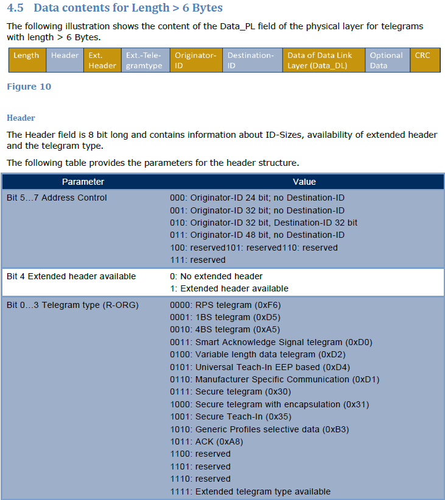
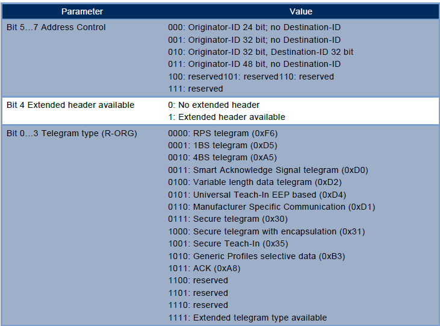
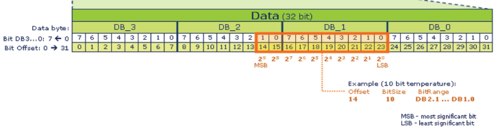

# EnOcean Packet Format

### EnOcean Seminar textbook in 2020 volume 2 / enocean packet format

EnOcean IoTシステム開発コンテスト！meet up：EnOcean Packet Format

- GitHub Page<br/>
    https://ahidaka.github.io/EnOceanSeminar2020-2/enocean-format.html

<br/>

### [EnOcean IoTシステム開発コンテスト！meet up 募集・資料ページ](https://algyan.connpass.com/event/183265/)

- URL<br/>
    https://algyan.connpass.com/event/183265/

<br/>

### [メインページ：EnOcean IoTシステム開発コンテスト！meet up 実習用テキスト](README.md)

- GitHub Page<br/>
    https://ahidaka.github.io/EnOceanSeminar2020-2

<br/>


##### 写真：EnOceanマルチセンサー STM550J
<br/>

---
## はじめに
---

この文書では、[EnOcean IoTシステム開発コンテスト！meet up 実習用テキスト](README.md)に記載されていない、EnOcean パケットの形式について説明します。

1回のEnOcean通信で送受信される一塊のテレグラムを、USB400J等のトランシーバーを介して非同期シリアル回線上で扱うをESP3(EnOcean Serial Protocol Version 3) 仕様ではパケットと呼んでいます。

ESP3(EnOcean Serial Protocol Version 3) は、USB400J等のトランシーバーとホストとのインターフェース仕様です。送信データ、受信データのほか、各種コマンド、レスポンス、イベント通知を扱います。

[参照：EnOcean Serial Protocol 3 (PDF)](https://www.enocean.com/fileadmin/redaktion/pdf/tec_docs/EnOceanSerialProtocol3.pdf)<br/>
https://www.enocean.com/fileadmin/redaktion/pdf/tec_docs/EnOceanSerialProtocol3.pdf

ここでは説明を簡略化するため、原則として STM550Jマルチセンサーの工場出荷時の設定（非暗号化、EEP:D2-14-41）を対象としています。
他の形式は本文中で紹介する参考資料を参照して下さい。

<br/>

---
## EnOcean パケットの概要
---

EnOcean 通信仕様は随時更新されて来ているため、国やデバイスの導入時期によって仕様に差があります。
現在の日本国内向け規格の 928.35MHz 1mW 出力に対応するトランシーバーインターフェース仕様（**ESP**）は、詳細には、**ERP2 on ESP3** と呼ぶ2013年に制定された比較的新しい仕様です。

この928.35MHz 仕様向けの詳細は形式は、前記ESP3仕様書の 100ページ、**Packet Type 10: RADIO_ERP2** として次の通り記載されています。
後から ESP3 に追加された仕様のため、ESP3 仕様の前半には出て来ません。注意が必要です。
なおこの表で **RAW data** と呼ぶ **ERP2 on ESP3** 形式のデータ部の仕様は、ERP2(EnOcean Radio Protol Version 2) 仕様に記載されているデータ部の仕様に従うことになります。


[参照：EnOcean Radio Protocol 2 (PDF)](https://www.enocean.com/fileadmin/redaktion/pdf/tec_docs/EnOceanRadioProtocol2.pdf)<br/>
https://www.enocean.com/fileadmin/redaktion/pdf/tec_docs/EnOceanRadioProtocol2.pdf

<br/>

---
## パケット受信プログラム
---

ここでは次の DefaultMultiSensor ソリューションに含まれる、**MainWindow.xaml.cs** を題材にして解説します。
合わせて、参考にしてください。

[EnOceanWindowsSamples/DefaultMultiSensor](https://github.com/ahidaka/EnOceanWindowsSamples)
https://github.com/ahidaka/EnOceanWindowsSamples

[MainWindow.xaml.cs](https://github.com/ahidaka/EnOceanWindowsSamples/blob/master/DefaultMultiSensor/DefaultMultiSensor/MainWindow.xaml.cs)
https://github.com/ahidaka/EnOceanWindowsSamples/blob/master/DefaultMultiSensor/DefaultMultiSensor/MainWindow.xaml.cs

<br/>

---
## ESP3: ヘッダー入力とCRC計算
---

パケット受信プログラムのサンプルコードは、前述のESP3仕様書の **3. Appendix** 112ページ、**3.4.2 Get ESP3 Packet** 節で公開されています。
前述の **MainWindow.xaml.cs** で使用しているシリアルデータ入力部分は、このサンプルの公開前に独自に開発したものがベースになっています。

300行目から325行目が **Header** 入力部です。
前述のサンプルとは構造も違い、全体として短くなっていますが、今までの運用で特に問題になっていません。
この入力プログラムでは、**Sync. Byte 0x55** を見つけた後、ヘッダー部5バイトをまとめて入力していますが、この方法でヘッダー部のデータを取りこぼしたことはありません。

一方でヘッダー以降の **DATA部** と **Optional Data部** は、1回のRead処理で全データを読み込み出来ない場合があるため、この様に1バイトReadを繰り返し発行しています。

なお Linux 環境用の **DolphineRide** や **EnOceanTest** のプログラムの入力部分は、前述の **Get ESP3 Packet** サンプルに準じた構成となっています。

317行目では、ヘッダー部が正しく入力できたことを確認するために **CRC8** を計算しています。
ESP3形式では、CRCが2か所にあるため、ヘッダー部のCRCを **CRC8H** と呼び、データ部の **CRC8D** と区別しています。
CRC8 の計算方法は、前述のESP3仕様書の **3.3 CRC8 calculation** に掲載されています。 

```C#
		try
		{
			do
			{
				serialPort1.Read(readBuffer, 0, 1);
			}
			while (readBuffer[0] != 0x55);
			// need catch

			serialPort1.Read(header, 0, 4);

			dataLength = header[0] << 8 | header[1];
			optionalLength = header[2];
			packetType = (PacketType)header[3];

			serialPort1.Read(readBuffer, 0, 1);
			crc8h = readBuffer[0];
			gotHeader = crc8h == crc.crc8(header);
		}
		catch (Exception e)
		{
			Debug.WriteLine(e.Message);
			return;
		}
```

以降はこの **MainWindow.xaml.cs** のプログラムに沿いながら、関連する仕様を紹介します。

<br/>

---
## ERP2: PacketType, TelegramType と Originator-ID
---

**PacketType** は、**Sync. Byte 0x55** を含まずに計算した場合のヘッダーの 3バイト目にある、このパケットの内容・目的を示す区分です。
ESP3では、単なる受信データの取得のほかに、システムに対するコマンドの送受信、データ送信とそのレスポンス、システムからのイベント通知といったメッセージを扱います。
それの区分をするのが、この **PacketType** です。

**ERP2 on ESP3** の受信データは、データ部が古い **ERP1** 仕様とは異なる形式で送られて来ます。
それは、**PacketType** が **0x0A** の **(RADIO_ERP2, 旧名 RadioAdvanced)** 形式として区別します。
他の値がセットされているこの形式以外のパケットは使用しないため、受信処理から除外します。（プログラムの 365行目 ）

**TelegramType**（変数名 **telType**） は受信した電波の種別です。EnOcean では通信デバイスの特性に合わせて、最小限度の大きさ、形式の電波フォーマットを使用します。それを区別するのが **TelegramType** です。詳細は、前述 [ERP2仕様書](https://www.enocean.com/fileadmin/redaktion/pdf/tec_docs/EnOceanRadioProtocol2.pdf) の17ページ **4.5 Data contents for Length > 6 Bytes** で解説されている下記の **Header** が該当します。



<br/>

この説明と図は不親切で分かり難いのですが、前述の **ERP2 on ESP3** 仕様と合致させた場合、次の様になります。

| (ESP3-Header) | ESP3-Data (telegram Type) | ESP3-Data (Originator-ID) | ESP3-Data | ESP3-Optional Data | ESP3-CRC8D |
|:-:|:-:|:-:|:-:|:-:|:-:|
| (ERP2-Length) | **ERP2-Header** | **ERP2-Originator-ID** | ERP2-Data_DL | ERP2-Optional Data | ERP2-CRC |

<br/>

補足説明を以下に示します。

- **Originator-ID** とは Source IDとも呼ばれる、送信元の **EURID (EnOcean Unique Radio Identifir)** の事です。
- **Originator-ID** は昔からのEnOceanでは32bitでしたが、日本向け仕様策定の際に電波法が規定する「無線デバイスのマシンアドレスは48bit以上必要」条項に対応するため、ERP2で48bit対応の可変ビット長仕様が追加されました。
- しかし928MHz 日本仕様での使い易さを配慮して、完全な 48bit の Originator-ID が送出されるのは、**Teach-In** テレグラムだけとして、通常のデータテレグラムでは、簡便な32bitの **Originator-ID** が送出されます。
- 従って国内向けデバイスでは、Teach-InはSource ID 48bit長、通常データはSource ID 32bit長となります。
- 現在国内向けデバイスのSource ID 32bitでは上位16bitが切り捨てられ、また48bit表現では、上位16bitにはゼロが入っています。
- **Extended Header** は、ERP2仕様書 18ページ上部に記載の通り、Line Powered（常用電源装備）デバイスだけが必須のフィールドで、一般的なセンサーデバイスでは持ちません。
- **Extended Telegram Type** は、デフォルト状態のマルチセンサーでは使用しません。
- **Destination-ID** は、一般的なEnOceanセンサーでは使用しません。

<br/>


ここで、次の形式で示される1バイトの **ERP2-Header** は、そのまま **ERP2 on ESP3** の **Telegram Type** となります。



<br/>

これらの事から、暗号化セキュリティーが無効なマルチセンサーが受信する可能性があるのは、次の **TelegramType (ERP2 Header)** となります。 

| TelegramType=ERP2 Header | 意味 |
|:-:|:-:|
|0x61| Src 48bit 1BS, Teach-In
|0x62| Src 48bit 4BS, Teach-In
|0x65| Src 48bit UTE, Teach-In
|0x21| Src 32bit 1BS, Data
|0x22| Src 32bit 4BS, Data
|0x24| Src 32bit VLD, Data

<br/>

**MainWindow.xaml.cs** の365行目から409行目では次の様に、これらをそのままプログラムしています。

この中で **telType** が、**0x61, 0x62, 0x65** の場合に、**dataOffset = 2** としているのは、実質32bitの **Originator-ID** の切り出し位置調節のためです。
このプログラムで、telType が 0x20 (Src 32bit RPS, Data) の case 文が記述されているのは、テレグラムの処理がやや異なるためのメモです。
これは実際には実行されないコードで、将来 RPS テレグラムをここで処理する場合の準備です。

```C#
		switch (telType)
		{
			case 0x61: //Src 48bit 1BS, Teach-In
				dataOffset = 2;
				validTelegram = true;
				teachIn = TeachIn._1BS;
				break;
			case 0x62: //Src 48bit 4BS, Teach-In
				dataOffset = 2;
				validTelegram = true;
				teachIn = TeachIn._4BS;
				break;
			case 0x65: //Src 48bit UTE, Teach-In
				dataOffset = 2;
				validTelegram = true;
				teachIn = TeachIn._UTE;
				break;
			case 0x20: //Src 32bit RPS, Data, backup
				eb0 = (readBuffer[leadings + dataOffset] >> 7) & 0x01;
				db0 = (byte)(readBuffer[leadings + dataOffset] & 0x0F);
				validTelegram = true;
				Debug.WriteLine($"{eb0:X} {db0:X}");
				teachIn = TeachIn._RPS;
				break;
			case 0x21: //Src 32bit 1BS, Data
				validTelegram = true;
				break;
			case 0x22: //Src 32bit 4BS, Data
				validTelegram = true;
				break;
			case 0x24: //Src 32bit VLD, Data
				validTelegram = true;
				break;
			default:
				Debug.WriteLine($"Unknown telType = {telType:X}");
				break;
		}
```

<br/>

---
## 電波強度
---

電波強度は、USB400Jなどのトランシーバーが電波を受信した時に観測した、電波の強さです。

各テレグラム受信の都度ESP3仕様に従って、トランシーバーが測定していてその受信したテレグラムのデータの後方に **Optional Data** の情報として付加しています。
空中線を飛ぶテレグラムの内容では無く、トランシーバーとのインターフェース仕様のため、**ESP3** の **Optional Data** として扱います。

これは前述のESP3仕様書 100ページ、**Packet Type 10: RADIO_ERP2** Optional Data の2バイト目、**dBm** の項で説明されています。
928MHz 帯 1mW (0dBm) の電波強度は、最大が 0 dBm のマイナス値で表示します。
マイナス値が大きい方が電波が弱くなり、-100 dBm を超えるような弱い電波は実質的にほとんど受信できません。
説明を読めばわかる通り、ここの値はマイナス記号を排除した値で出力されているため、使用する場合にはマイナス記号を付加する等の処理が必要です。

<br/>

**MainWindow.xaml.cs** の371行目では、受信したreadBufferに中のオフセット、**dataLength + 1** すなわち **Optional Data** のオフセット **1バイト目** からデータを取り出して **radioStrength** 変数にセットしています。

<br/>


```C#
        radioStrength = readBuffer[dataLength + 1];
```

<br/>

---
## EEP
---

そのデバイスが何であるか？どの様なセンサーを持ち、それぞれのセンサーの特性やデータの最大値、最小値、解像度（データの粒度）、
テレグラム中でのビット表現といったEnOcean デバイスのアプリケーション仕様（プロファイル）を詳細に規定しているが、**EEP(EnOpen Equipment Profile)** です。
EEPはEnOcean 正規会員が希望の仕様をEnOcean Allianceに提出して、承認を得た場合に割り当てられる 21bit の16進番号です。

同じくEnOcean データのアプリケーションプロファイル仕様には、会員であれば承認無しで利用可能な **GP (Generic Profile)** があります。
GP はマルチセンサーが対応していないため、ここでの説明を省略します。

[参考：Generic Profiles Specification v1.2 (PDF)](https://www.enocean-alliance.org/gp/)<br/>
https://www.enocean-alliance.org/gp/

<br/>

デフォルト状態のマルチセンサーのデータ部の構成には、**EEP** の **D2-14-41** が割り当てられています。

 **D2-14-41** 仕様は、次の手順で参照します。
<br/>

### EEP の検索

EnOcean Alliance が定めた仕様は、以下のEnOcean Alliance の **Technical Specifications** ページに載っています。

[Technical Specifications](https://www.enocean-alliance.org/specifications/)<br/>
https://www.enocean-alliance.org/specifications/


EEP仕様全般と注意点は以下のEnOcean Equipment Profiles v3.1 に載っています。

[EnOcean Equipment Profiles v3.1 (PDF)](https://www.enocean-alliance.org/eep/)<br/>
https://www.enocean-alliance.org/eep/

個別の各EEP番号ごとの仕様は、以下のEEPViewerを使用して表示させます。

[EEP Viewer Tool](http://tools.enocean-alliance.org/EEPViewer/)<br/>
http://tools.enocean-alliance.org/EEPViewer/

<br/>

---
## マルチセンサー EEP: D2-14-41
---

**D2-14-41** のEEP仕様は、

http://tools.enocean-alliance.org/EEPViewer/
のページで、

**D2: VLD Telegram**

を選択して、

**D2-14 Multi Function Sensors**

に進みます。そこの **D2-14-41** の行から PDF, XML, 等の各形式で仕様を入手できます。


<br/>

仕様内容詳細は、次に示すPDF形式に説明されています。

http://tools.enocean-alliance.org/EEPViewer/profiles/D2/14/52/D2-14-41.pdf

<br/>

**D2-14-41** の説明は次の通りです。

| RORG | FUNC | TYPE |
|:-:|:-:|:-:|
| D2 | 14 | 41 | 
| VLD Telegram | Multi Function Sensors | Indoor -Temperature, Humidity XYZ Acceleration, Illumination Sensor, Window Contact | 

<br/>

マシンで読み取り、再利用するためにはXML形式を推奨します。JSON 形式は Bit Offset と Bit Size が含まれないため利用できません。

オンライン環境であれば前述の、
http://tools.enocean-alliance.org/EEPViewer/profiles/D2/14/41/D2-14-41.xml
を参照することで、D2-14-41 の必要情報を取得できます。

<br/>

### 参考：DolphinView

補足情報ですが、DolphinView Advanced をインストールした Windows 環境の
```sh
C:\Program Files\EnOcean\DolphinView\Resources\eep.xml
```
ファイルには、DolphinView が使用する全EEPが含まれています。

<br/>

### 参考：EEP の RORG-FUNC-TYPE とは？

EEP番号を構成する3桁、21bitの16進数番号です。RORG 8bit, FUNC 6bit, TYPE 7bit の値が割り当てられます。

- RORG<br/>
	Radio-Originator の意味で、EnOceanデバイスや利用するテレグラム形式の特性別に割り当てられます。次の種類があります。
	ERP2ではTelegramTypeから自動判別（変換）が可能です。

	* **RPS**<br/>
		ロッカースイッチ、または同等の電磁誘導発電デバイス専用のRORGです。<br/>
		1st-2nd のセット動作、最大8点までボタン情報送信に適した、最小のテレグラム形式です。
		Teach-In テレグラムが無いため、デバイスの Originator-ID 等で識別する必要があります。

	* **1BS**<br/>
		マグネット・コンタクト（開閉センサー）または、同等品専用のRORGです。<br/>
		このRORGのFUNC, TYPEは現状の **FUNC=00, TYPE=01** だけで、拡張しない事になっています。

	* **4BS**<br/>
		4バイトのデータ格納部を持つ、EEP-RORGです。<br/>
		多くの温度センサー、湿度センサーで利用されています。

	* **VLD**<br/>
		最大14バイトまでデータを扱う、可変長定義のVLD(Variable Length Data)形式です。<br/>
		UTE形式のTeach-In テレグラムを使用します。

- FUNC<br/>
	用途機能別分類です。一般にセンサーの種類、または複数センサーの場合は組み合わせ種類別に割り当てられます。<br/>

- TYPE<br/>
	詳細分類です。温度センサーの例では、解像度ビット数の違いや温度範囲の違いで、異なるタイプを割り当てます。<br/>

<br/>

### 参考：センサーデバイス側の対応

EEPでは、センサーデバイス側が自力でEEPに適合したデータを持つテレグラムを送出する必要があります。

つまりAD変換値がEEP適合になる範囲で線形（リニア）に変化する様に較正、補正するための回路、オペアンプなどを搭載する必要があります。
センサーデバイスは、後述の **Teach-In** テレグラム送出用の **LEARN** ボタンも持つ必要があります。

他のIoT実験回路で良く見る様な、無線チップにアナログセンサー付加しただけでは、EnOcean対応とはならないので注意が必要です。

<br/>

### EEP内容

EEP定義は各センサーのポイント（測定点）毎に、主に次の項目に示すパラメーターで割り当てられます。

| Offset | Size | Data | Description | Valid Range | Scale | Unit | 
|:-:|:-:|:-:|:-:|:-:|:-:|:-:|
| bit 開始位置 | bit サイズ | データ名 | 説明 | 有効レンジ | スケール | 表示単位 | 

<br/>

- Offset
	データビットの開始位置を示します。
	**Data** 領域中に、**Header** 側から前詰めで、データを配置します。
	EnOceanのデータ配置では、バイト（8bit）単位のバウンダリーは考慮せず、通常各データを前詰めで配置します。

- Size
	データビットの大きさ（占有ビット数）を示します。<br/>
	[EEP Fact Sheet](https://www.enocean-alliance.org/factsheet-eep) の以下の図が示す通り、EnOceanテレグラム中の各データは前詰めで、MSBを先に、LSBを後に配置します。
	このbitサイズが最小の粒度、すなわちデータの精度（解像度）を規定します。</br>
<br/>

[参考：EEP Fact Sheet (PDF)](https://www.enocean-alliance.org/factsheet-eep/)<br/>
https://www.enocean-alliance.org/factsheet-eep/

<br/>



- Data
	各データの名称を示します。

- Description
	各データの説明を示します。

- Valid Range
	各データの有効な値の範囲を示します。
	ここでの値は、前述の **Offset** と **Size** で切り出したデータの値の中で有効な範囲を記載します。

- Scale
	元データのバイナリー値に対応した、変換後の（あるべき）値を示します。

- Unit 
	各データを表示する際に使用する **単位** 文字（列）を示します。

<br/>

マルチセンサー STM550J が使用する、**D2-14-41** の各データ値をXMLファイルから抜き出して、例外とエラーを外して整理後、Data Typeを付加すると次の様になります。

|Offset|Size|Data|Description|Data Type|Range min|Range max|Scale min|Scale max|Unit| 
|:-:|:-:|:-:|:-:|:-:|:-:|:-:|:-:|:-:|:-:|
|0|10|temperature|Temperature 10|Data|0|1000|-40|60|℃|
|0|10|temperature|Temperature 10|Data|0|1000|-40|60|°C|
|10|8|humidity|Rel. Humidity linear)|Data|0|200|0|100|%|
|18|17|Illumination|Illumination linear)|Data|0|100000|0|100000|lx|
|35|2|Acceleration Status|Status of the sensor|Enum|0=Periodic Update|1=Threshold 1 exceeded|2=Threshold 2 exceeded|
|37|10|Acceleration X|Absolute Acceleration on X axis|Data|0|1000|-2.5|2.5|g|
|47|10|Acceleration Y|Absolute Acceleration on Y axis|Data|0|1000|-2.5|2.5|g|
|57|10|Acceleration Z|Absolute Acceleration on Z axis|Data|0|1000|-2.5|2.5|g|
|67|1|Contact|Contact key|Enum|0=Open|1=Closed|
|68|4|Not Used (= 0)||||

<br/>

ここで整理した各データポイントのビット数、最小値、最大値の各パラメーターから自動的にビットデータの変換式を求めることが可能です。

問題は **Enum**（列挙）型のデータの扱いです。
今回のサンプルプログラムでは、実用上の問題が無い事から、生の入力整数値をそのまま表示することにしました。

<br/>

この表をさらに加工して、C# プログラムで扱う形式にしたプログラムを以下に示します。
元ネタは、[**EnOceanGateways**](https://github.com/ahidaka/EnOceanGateways) のDolphinRide/ptable.c です。
ShortCut はデータ種別を示す、**短い名前** です。以前のEEP定義には含まれていましたが、最近のEEPでは廃止されました。
元ネタの **DolphinRide** ではデータポイントを区別して扱うために便利だったため、付加しています。

本来ならば、このEEP定義の様なデータ量がある程度あるパラメーター値の配列やリストは、別ファイルにしてプログラムで読み取る様な設計にすべきですが、
今回のプログラムはマルチセンサー専用であることと全体を見渡せる様にするため、プログラム中に埋め込みました。

```C#
	Datafields datafields = new Datafields {
		{
			(VALUE_TYPE)1, //ValueType
			"Temperature 10", //DataName
			"TP", //ShortCut
			0, //Bitoffs
			10, //Bitsize
			0, //RangeMin
			1000, //RangeMax
			(float) -40, //ScaleMin
			(float) 60, //ScaleMax
			"℃" //Unit
			//{{0, ""}} //Enum
		},
		{
			(VALUE_TYPE)1,
			"Humidity",
			"HU",
			10, //Bitoffs
			8, //Bitsize
			0, //RangeMin
			200, //RangeMax
			(float) 0, //ScaleMin
			(float) 100, //ScaleMax
			"%" //Unit
			//{{0, NULL}}, //Enum
		},
		{
			(VALUE_TYPE)1,
			"Illumination",
			"IL",
			18, //Bitoffs
			17, //Bitsize
			0, //RangeMin
			100000, //RangeMax
			(float) 0, //ScaleMin
			(float) 100000, //ScaleMax
			"lx" //Unit
			// { { 0, NULL} }, //Enum
		},
		{
			(VALUE_TYPE)3,
			"Acceleration Status",
			"AS",
			35, //Bitoffs
			2, //Bitsize
			0, //RangeMin
			3, //RangeMax
			(float) 0, //ScaleMin
			(float) 3, //ScaleMax
			"" //Unit
			// { { 0, "Periodic Update"},{ 1, "Threshold 1 exceeded"}, { 2, "Threshold 2 exceeded"} }, //Enum
		},
		{
			(VALUE_TYPE)1,
			"Acceleration X",
			"AX",
			37, //Bitoffs
			10, //Bitsize
			0, //RangeMin
			1000, //RangeMax
			(float) -2.5, //ScaleMin
			(float) 2.5, //ScaleMax
			"g" //Unit
			//{ { 0, NULL} }, //Enum
		},
		{
			(VALUE_TYPE)1,
			"Acceleration Y",
			"AY",
			47, //Bitoffs
			10, //Bitsize
			0, //RangeMin
			1000, //RangeMax
			(float) -2.5, //ScaleMin
			(float) 2.5, //ScaleMax
			"g" //Unit
			//{ { 0, NULL} }, //Enum
		},
		{
			(VALUE_TYPE)1,
				"Acceleration Z",
				"AZ",
				57, //Bitoffs
				10, //Bitsize
				0, //RangeMin
				1000, //RangeMax
				(float) -2.5, //ScaleMin
				(float) 2.5, //ScaleMax
				"g" //Unit
				//{ { 0, NULL} }, //Enum
		},
		{
			(VALUE_TYPE)3,
				"Contact",
				"CO",
				67, //Bitoffs
				1, //Bitsize
				0, //RangeMin
				1, //RangeMax
				(float) 0, //ScaleMin
				(float) 1, //ScaleMax
				"" //Unit
				//{ { 0, "Open"}, { 1, "Close"} }, //Enum
		},
		{
			(VALUE_TYPE)1,"","",0,0,0,0,(float) 0,(float) 0,"" /*{{0, NULL}}*/
		}
	};
```

<br/>

データビット列（バイナリー値、**x**）から、実データ(**y**)への変換は、次の一次方程式で算出します。
これの **a** が傾き(**slope**)、**b** が差分(**offset**) です。

<br/>

```
	y = ax + b
```

<br/>

データビット列(**partialData**)、傾き(**slope**)、**b** が差分(**offset**) の各パラメーターは、EEP定義から次の様に算出します。
599行目です。

```C#
		slope = ba.CalcA(df.RangeMin, df.ScaleMin, df.RangeMax, df.ScaleMax);
		offset = ba.CalcB(df.RangeMin, df.ScaleMin, df.RangeMax, df.ScaleMax);
		partialData = (int) ba.GetBits(data, (uint) df.BitOffs, (uint) df.BitSize);
```

<br/>

**GetBits, CalcA, CalcB** のソースコードは、1293行目からの **BitArray**クラスで定義しています。

```C#
    public class BitArray
    {
        const int SZ = 8;
        const ulong SEVEN = 7;

        public ulong GetBits(byte[] inArray, uint start, uint length)
        {
            ulong ul = 0;
            uint startBit = (uint)start % SZ;
            uint startByte = (uint)start / SZ;
            //BYTE* pb = &inArray[startByte];
            uint posInArray = startByte;
            ulong dataInArray;
            uint i;
            uint pos;

            pos = startBit;
            for (i = 0; i < length; i++)
            {
                ul <<= 1;
                dataInArray = inArray[posInArray];
                ul |= (dataInArray >> (int)(SEVEN - pos++)) & 1;
                if (pos >= SZ)
                {
                    pos = 0;
                    dataInArray++;
                }
            }
            return ul;
        }

        public double CalcA(double x1, double y1, double x2, double y2)
        {
            return (double)(y1 - y2) / (double)(x1 - x2);
        }

        public double CalcB(double x1, double y1, double x2, double y2)
        {
            return (((double)x1 * y2 - (double)x2 * y1) / (double)(x1 - x2));
        }
    }
```


<br/>

---
## Teach-In / UTE
---

**Teach-In テレグラム** はEnOceanセンサーデバイスの **LEARNボタン** を押すと送信される、プロファイル情報です。
各デバイス種別（**RORG**）毎に、[EEP仕様](https://www.enocean-alliance.org/eep/)の17ページ **3.2 Teach-In**　送信方法が規定されています。

**D2-14-41** は **VLD** のため、23ページ記載の **3.2.5. UTE – Universal Uni- and Bidirectional Teach-in** に従います。
ソースコードでは、522行目の **TeachInTelegram()** メソッド内の次の部分で、受信した **Teach-In** テレグラムを処理しています。

```c#
		case 0x65: //Src 48bit UTE, Teach-In
			rorg = data[6];
			func = data[5];
			type = data[4];
			manID = (uint)data[3] & 0x07;
			break;
```

この例を見てもわかる通り、マルチセンサーの **Teach-In** テレグラム処理は、**RORG, FUNC, TYPE, Manufacture ID (manID)** を取り出す事だけです。
Manufacture IDは、EnOcean Allianceに登録済のデバイス製造元メーカー番号です。

<br/>

---
## 仕様書 まとめ
---

Knowledge Base & System Specification
https://www.enocean.com/en/support/knowledge-base/


EnOcean Radio Protocol 1 (PDF)
https://www.enocean.com/fileadmin/redaktion/pdf/tec_docs/EnOceanRadioProtocol1.pdf

EnOcean Radio Protocol 2 (PDF)
https://www.enocean.com/fileadmin/redaktion/pdf/tec_docs/EnOceanRadioProtocol2.pdf

EnOcean Serial Protocol 3 (PDF)
https://www.enocean.com/fileadmin/redaktion/pdf/tec_docs/EnOceanSerialProtocol3.pdf


### EEP 関連

Technical Specifications
https://www.enocean-alliance.org/specifications/

Fact Sheet (PDF)
https://www.enocean-alliance.org/factsheet-eep/

EnOcean Equipment Profiles v3.1 (PDF)
https://www.enocean-alliance.org/eep/

EEP Viewer Tool
http://tools.enocean-alliance.org/EEPViewer/


以上
