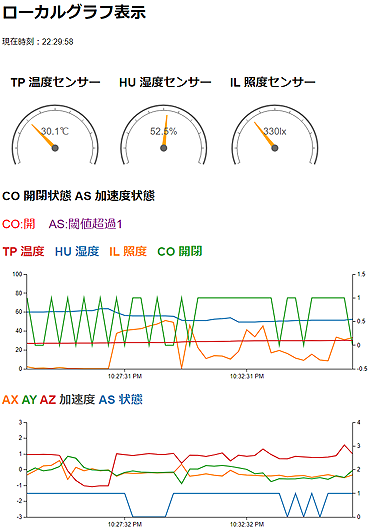

# epoch-sample


### EnOcean Seminar textbook in 2020 volume 2 / Epoch sample

EnOcean IoTシステム開発コンテスト！meet up： Epoch サンプル

- GitHub Page<br/>
    https://ahidaka.github.io/EnOceanSeminar2020-2/epoch-sample.html

<br/>

### [EnOcean IoTシステム開発コンテスト！meet up 募集・資料ページ](https://algyan.connpass.com/event/183265/)

- URL<br/>
    https://algyan.connpass.com/event/183265/

<br/>

### [メインページ：EnOcean IoTシステム開発コンテスト！meet up 実習用テキスト](README.md)

- GitHub Page<br/>
    https://ahidaka.github.io/EnOceanSeminar2020-2/

<br/>


##### 写真：EnOceanマルチセンサー STM550J
<br/>

---
## はじめに
---

この文書は、[EnOcean IoTシステム開発コンテスト！meet up 実習用テキスト](README.md) を補足する、**Epoch** によるデータ表示サンプルプログラムの解説です。

[**Epoch**](http://epochjs.github.io/epoch/) または [**Epoch.js**](http://epochjs.github.io/epoch/) は、Javascriptで記述された [D3.js](https://d3js.org/) ベースのWebページ用のグラフ表示ライブラリです。
比較的容易にリアルタイムに変化するグラフ描画が出来る点が特長です。

ここでは [メインページ](README.md)で解説している dpride (Dolphin Ride プログラム、以後 dpride) の **-j** オプション（JSONファイル出力サーバー）にsocket接続する、Node.js Web サーバーと対応する index.html を紹介します。

<br/>

---
## 説明
---

### サンプルプログラム

Node.js が使用する **app.js** と **index.html**, 及び epoch ライブラリ全体は、以下にあります。
[EnOceanGateways/DolphinRide/epoclient/](https://github.com/ahidaka/EnOceanGateways/tree/master/DolphinRide/epoclient)

**DolphinRide** が含まれる [EnOceanGateways](https://github.com/ahidaka/EnOceanGateways) を入手し直せば DolphinRide 以下の epoclient ディレクトリに必要なファイルがあります。

<br/>

### 起動方法 

事前に、マルチセンサーを **dpride** に登録しておきます。
次に、以下の様に **dpride** を **-j** オプション付でオペレーションモードで起動します。

```shell
$ sudo ./dpride -j -o
```

そして別shellを起動後、**epoclient** ディレクトリに移動して、Node.js を sudo 起動します。
```shell
$ cd epoclient
$ sudo node ./app.js
```

あとはブラウザで上記の dpride 及び Node.js 起動マシンに接続して、マルチセンサーのデータを受信すると、グラフ描画が始まります。

<br/>

---
## 出力サンプル
---

Epoch によるグラフ描画のサンプルを以下に示します。

**Epcoh** によるグラフとゲージの描画のほか、開閉センサーの状態と加速度センサーの閾値の状況をリアルタイムに変化する文字として表示しています。 

<br/>

[](image/epoch.png)


以上
